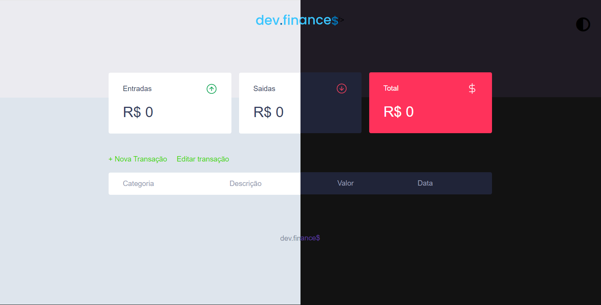

<h1 align="center">
  
</h1>


<div align="center">
    <p>No projeto original, foi iniciado apenas com HTML, CSS e Javascript. porém eu queria testar o meu conhecimento, fazer com outras tecnologias.</p>
  <p>O dev.finances é uma aplicação de controle financeiro, onde é possível cadastrar, excluir e editar transações e ver o saldo de entrada e saída 💰</p>
</div>

<p align="center">
  <a href="#-features">Features</a>&nbsp;&nbsp;&nbsp;|&nbsp;&nbsp;&nbsp;
  <a href="#-Rodando">Rodando o projeto</a>&nbsp;&nbsp;&nbsp;|&nbsp;&nbsp;&nbsp;
  <a href="#-Tecnologia">Tecnologias</a>&nbsp;&nbsp;&nbsp;|&nbsp;&nbsp;&nbsp;
  <a href="#memo-licença">Licença</a>
</p>


<p align="center">
  
</p>

<div id="Features" align="center">
    <h1>📰 Features</h1>
</div>


- [X] layout
- [X] CRUD da transação
- [X] adicionar categorias
- [X] Editar Transação e Categorias
- [X] salvar e ler dados do banco de dados
- [X] ordenar tabela de acordo com coluna x


<div id="pre-requisitos" align="center">
    <h4>Pré-requisitos</h4>
</div>


- [Git](https://git-scm.com)
- [Node.js](https://nodejs.org/en/)
- [VSCode](https://code.visualstudio.com/)

<div id="Rodando" align="center">
    <h1>🎲 Rodando</h1>
</div>


<div id="install" align="center">
    <h4>
        siga esses passos para instalar:
    </h4>
</div>

```bash
# clonando o projeto na sua maquina
$ git clone https://github.com/WesleyIsr4/Dev-Finance.git

#entre na pasta do projeto
$ cd Dev-Finance

#instale as dependencias com:
$ yarn install
#ou
$ npm install

#iniciando o servidor
$ yarn dev
#ou
$ npm run dev

#o servidor iniciara na porta:8080
#acesse em <https://localhost:8080>
```

<div id="Tecnologia" align="center">
   <h1>🚀 Tecnologia</h1>
</div>

Esse projeto foi desenvolvido com as seguintes tecnologias:

- Node.js
- Express
- Nunjucks
- Sqlite3

## 🔖 Layout

Você pode visualizar o layout do projeto através [desse link](https://www.figma.com/file/7Vu9DzUaCZIV4nibzkjgB4/dev.finance%24-Maratona-Discover). É necessário ter conta no [Figma](https://figma.com) para acessá-lo.


## :memo: Licença

Esse projeto está sob a licença ISC. Veja o arquivo [LICENSE](LICENSE.md) para mais detalhes.

---

Feito com ♥ by Wesley Israel  :wave:
